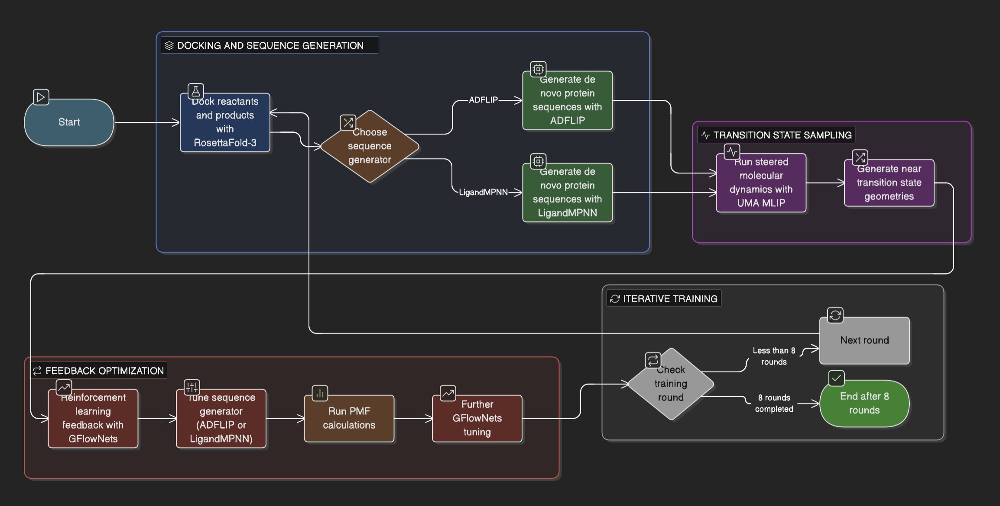
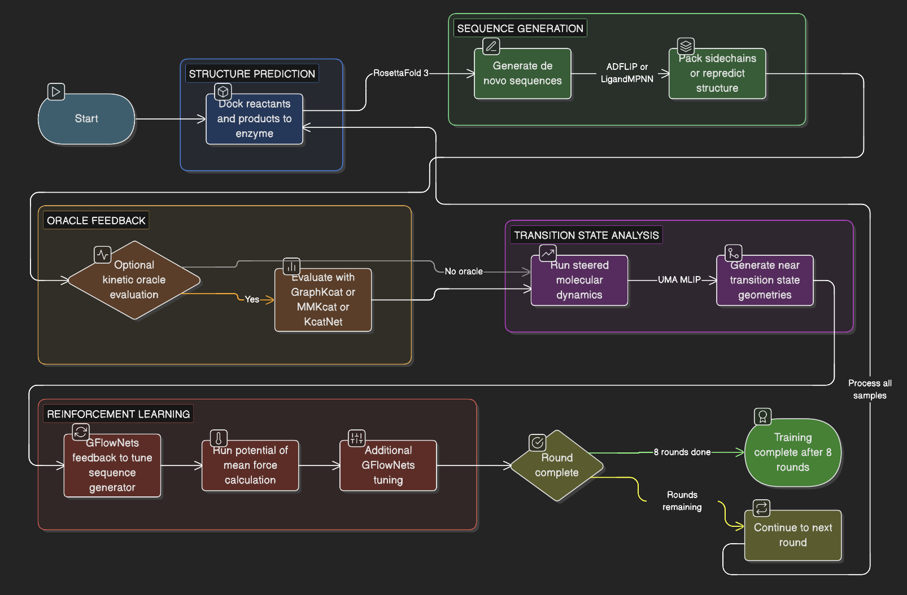

# ThermoGFN-IF

[](https://huggingface.co/blog/AmelieSchreiber/thermogfn-if) [](https://www.biorxiv.org/) [](./assets/paper/main.pdf)

## Training Paradigms 
### UMA MLIP only GFlowNets Training 
<p align="center">
  
</p>

### Full GFlowNets with Kinetic Oracle-feedback Training 
<p align="center">
  
</p>

### Binding Affinity and Thermostability GFlowNets Training Paradigms 
The binding affinity and thermostability GFlowNets style RL training paradigms are similar, with Tm utilizing the addition BioEmu, and SPURS oracles, and affinity leaning on UMA more. 

ThermoGFN-IF implementation scaffold for multi-fidelity protein design with Method III-first training.

Important implementation note:

- the edit-trajectory GFlowNet formulation in the paper is the target methodology,
- the current default catalytic `Method III` loop now performs actual **trajectory-balance GFlowNet fine-tuning of LigandMPNN** every round and samples the next candidate pool from that tuned LigandMPNN checkpoint,
- the separate lightweight one-shot student sampler is no longer the default deployed catalytic generator,
- ADFLIP is retained only as an ablation backend to train later.

The default catalytic path uses real FAIRChem/ASE UMA calculations where the protocol is physically supported: whole-enzyme UMA broad screening is always an actual `omol` UMA Langevin MD stage, while sMD / PMF barrier labels are emitted only for fully mapped topology-preserving reactant/product ligand endpoints. Topology-changing ligand pairs, incomplete atom maps, or unsupported reaction paths are marked unsupported instead of being pushed through a Cartesian morph or an artificial bond-breaking / bond-forming schedule. GraphKcat is enabled by default as an auxiliary prefilter/refinement oracle. For disconnected reactant mixtures, the wrapper scores the largest bonded carbon-containing substrate fragment and records the selected `graphkcat_input_smiles`, so GraphKcat is not treated as a full reaction-mixture oracle.

## Required conda environments

Default catalytic RL path (`UMA-cat` plus GraphKcat):

- `ligandmpnn_env`
- `fairchem` with `fairchem-core` installed
- `apodock`

Legacy / non-default stability-binding pipeline:

- `spurs`
- `bioemu`
- `uma-qc`

Optional generator ablation backend:

- `ADFLIP`

Minimal readiness checks for the default catalytic path:

```bash
conda run -n ligandmpnn_env python -c "import torch; print(torch.cuda.is_available())"
conda run -n fairchem python -c "import openmm; from fairchem.core import FAIRChemCalculator, pretrained_mlip; print(openmm.version.version); print(pretrained_mlip.pretrained_checkpoint_path_from_name('uma-s-1p2'))"
conda run -n apodock python -c "import huggingface_hub, rdkit, torch; print('graphkcat env ok')"
```

Do not prepend `./models/fairchem/src` to `PYTHONPATH` for production UMA runs. The checked-in FairChem source snapshot is older than the installed `fairchem` package and cannot load the cached `uma-s-1p2` checkpoint schema.

Full production-path readiness checks for the older stability/binding pipeline:

```bash
./scripts/env/check_envs.sh runs/env_status.json
# optional deep checks
RUN_HEALTH_CHECKS=1 ./scripts/env/check_envs.sh runs/env_status_health.json
```

Prefetch production oracle assets into a writable local cache before running the older stability/binding path:

```bash
./scripts/env/prefetch_production_oracles.sh
```

BioEmu requires a ColabFold runtime for embedding generation. Provision/check it explicitly:

```bash
./scripts/env/setup_bioemu_colabfold_runtime.sh
./scripts/env/setup_bioemu_colabfold_runtime.sh --check-only
```

If `bioemu` was created with Python 3.12 and ColabFold setup fails, rebuild `bioemu` on Python 3.11:

```bash
./scripts/env/rebuild_bioemu_env_py311.sh --env-name bioemu
```

## Data status

Current ready split:

- canonical path: `rfd3-data/rfd3_splits/unconditional_monomer_protrek35m`
- legacy alias still accepted by the prep scripts: `data/rfd3_splits/unconditional_monomer_protrek35m`
- current local catalytic RF3 pair split: `rfd3-data/rfd3_splits/rf3_reactzyme_protrek35m_catalyst_gt`
- copied catalytic endpoint assets: `rfd3-data/rf3_reactzyme_catalyst_gt/endpoints/{reactant,product}`
- current config-driven Catalyst-GT training JSONL: `runs/bootstrap/uma_cat_catalyst_gt_train.jsonl`

Future splits can be plugged in when generated under `rfd3-data/rfd3_splits/` or the legacy `data/rfd3_splits/` alias.

The current catalytic split is self-contained for this checkout: all referenced
reactant-bound and product-bound CIF endpoints have been copied into
`rfd3-data/rf3_reactzyme_catalyst_gt/endpoints`, and the split JSON files point
at those local paths. Older catalytic split snapshots may still contain absolute
RF3 endpoint paths from the machine where RF3 was run; do not use those for a
new run until their endpoints are materialized locally and the split validator
passes.

The current config-driven training JSONL was materialized from the Catalyst-GT
train split and contains `142` training rows. Rebuild it at any time with:

```bash
bash scripts/orchestration/run_uma_cat_catalyst_gt_8round.sh --rebuild-dataset --dry-run --no-progress
```

## Configuration (single source of truth)

Primary runtime configs:

- `config/m3_default.yaml` for the older stability/binding Method III path
- `config/uma_cat_m3_default.yaml` for the default catalytic Method III path
- `config/uma_cat_catalyst_gt_graphkcat_8round.yaml` for the current
  config-driven 8-round Catalyst-GT catalytic run with GraphKcat enabled

`config/m3_default.yaml` includes:

- generator backend and LigandMPNN generation controls,
- Method III round controls (`pool_size`, `bioemu_budget`, `uma_budget`, checkpoint retention),
- legacy teacher/student/surrogate knobs (`surrogate_ensemble_size`, `teacher_steps`, `teacher_gamma_off`, `student_steps`),
- oracle settings (`spurs repo/chain`, `bioemu model+num_samples`, `uma model+workers+replicates`),
- BioEmu VRAM-aware batching (`oracles.bioemu.batch_size_100`, `oracles.bioemu.auto_batch_from_vram`, `oracles.bioemu.target_vram_frac`, min/max bounds),
- periodic test sizing and final inference selection (`periodic_eval.num_candidates`, `inference.final.num_candidates`, `inference.final.top_k`).

`config/uma_cat_m3_default.yaml` is the default self-contained catalytic RL config and includes:

- generator backend, real LigandMPNN sequence fine-tuning controls, pocket-biased LigandMPNN sampling controls, and LigandMPNN side-chain packing controls,
- prepared-endpoint conditioning controls:
  - OpenMM hydrogenation at fixed pH,
  - heuristic first-shell water insertion,
  - short UMA `FIRE` relaxation before dynamics,
- UMA catalytic broad-screen controls,
- forward / reverse sMD controls with:
  - `300 K` Langevin dynamics,
  - `0.05 fs` timestep,
  - explicit friction in `ps^-1`,
  - weak whole-backbone endpoint guidance,
  - stronger pocket guidance,
  - interpolated `CA` elastic-network fold prior,
  - topology-preserving mapped-ligand endpoint pose steering only,
  - no ligand bond-breaking, bond-forming, internal-morph, or incomplete-map fallback path construction,
  - hard rejection of unsupported topology-changing paths and of paths that create excess ligand bonds or severe close contacts,
- optional PMF controls,
- sMD quality gates used to suppress unstable PMF seeds,
- optional GraphKcat refinement controls,
- catalytic fusion weights,
- Method III round budgets for `uma_cat_budget` and `graphkcat_budget`,
- W&B defaults under `logging.wandb` for round-level and experiment-level telemetry.

`config/uma_cat_catalyst_gt_graphkcat_8round.yaml` is the current training
entrypoint config for the local Catalyst-GT split. It sets:

- `run.run_id = uma_cat_catalyst_gt_graphkcat_8round`
- `run.output_root = runs/uma_cat_catalyst_gt_graphkcat_8round`
- `data.split_root = rfd3-data/rfd3_splits/rf3_reactzyme_protrek35m_catalyst_gt`
- `data.dataset_path = runs/bootstrap/uma_cat_catalyst_gt_train.jsonl`
- `method3.rounds = 8`
- `generator.backend = ligandmpnn`
- `oracles.envs.uma_cat = fairchem`
- `oracles.uma_cat.model_name = uma-s-1p2`
- `oracles.envs.graphkcat = apodock`
- `round.graphkcat_prefilter_fraction = 1.0`
- `round.uma_cat_budget = 16`
- `round.pool_size = 128`
- `generator.ligandmpnn.train.enabled = true`
- `generator.ligandmpnn.train.objective = trajectory_balance`
- `generator.ligandmpnn.train.steps = 15000`
- `generator.ligandmpnn.train.train_scope = decoder`
- `generator.ligandmpnn.sample.mutable_mode = pocket_random`
- `generator.ligandmpnn.sample.min_mutations = 3`
- `generator.ligandmpnn.sample.max_mutations = 12`
- `oracles.fusion.w_graphkcat = 0.55`
- `oracles.fusion.w_agreement = 0.20`
- `logging.wandb.enabled = true`
- `logging.wandb.mode = auto`

The corresponding launcher is:

```bash
bash scripts/orchestration/run_uma_cat_catalyst_gt_8round.sh
```

### Real LigandMPNN GFlowNet fine-tuning

For catalytic runs, LigandMPNN is now the default trainable sequence
generator. Each round writes:

- `runs/<run_id>/round_<id>/models/ligandmpnn_gflownet_round_<id>.pt`
- `runs/<run_id>/round_<id>/models/ligandmpnn_generator_metrics.json`
- `runs/<run_id>/round_<id>/metrics/ligandmpnn_generator_history_round_<id>.jsonl`
- `runs/<run_id>/round_<id>/metrics/ligandmpnn_pool_metrics_round_<id>.json`

The generator training script runs an actual optimizer step through
LigandMPNN's differentiable `ProteinMPNN.score(...)` path. The default
objective is trajectory balance over canonical edit trajectories reconstructed
from the current round dataset:

```text
L_TB = (log Z(seed) + log P_F^LigandMPNN(traj) - log R(x) - log P_B(traj | x))^2
```

where `P_F^LigandMPNN` is computed from real LigandMPNN residue logits at each
intermediate edited sequence state, `R(x)` is the positive fused oracle reward,
and `P_B` is the uniform reverse trajectory probability for the edit set. The
checkpoint also stores the trainable stop head and per-seed `log Z` table under
`thermogfn_gflownet_state`. A small supervised NLL term is kept as an auxiliary
anchor so early rounds with only baseline rows do not leave the decoder
unconstrained; `reward_weighted_nll` remains available only as an explicit
fallback objective.

The default trainable scope is `decoder`, which updates `W_s`, the decoder
layers, and `W_out` while keeping the structural encoder stable. Use
`generator.ligandmpnn.train.train_scope: full` only when the labeled dataset and
GPU budget are large enough to justify full-model fine-tuning.

Candidate generation samples from the tuned LigandMPNN checkpoint. The default
`pocket_random` mask fixes most of the chain and lets LigandMPNN redesign a
small pocket-biased residue subset:

```yaml
generator:
  backend: ligandmpnn
  ligandmpnn:
    checkpoint: models/LigandMPNN/model_params/ligandmpnn_v_32_010_25.pt
    train:
      enabled: true
      objective: trajectory_balance
      steps: 15000
      train_scope: decoder
      learning_rate: 1.0e-5
      reward_weight_mode: reward
      baseline_weight: 0.10
      reward_floor: 1.0e-3
      tb_labeled_fraction: 0.75
      anchor_l2: 1.0e-6
    sample:
      mutable_mode: pocket_random
      min_mutations: 3
      max_mutations: 12
      pocket_fraction: 0.75
      temperature: 0.2
```

This still uses real LigandMPNN autoregressive sampling for the mutable
positions; it simply keeps the rest of the seed sequence fixed so catalytic
rounds do not default to whole-enzyme redesigns with hundreds of mutations.
Set `mutable_mode: full_chain` only for deliberate full redesign experiments.

All updated orchestration scripts accept `--config` and allow CLI overrides.
`scripts/orchestration/uma_cat_m3_run_experiment.py` can now read `run.run_id`,
`run.output_root`, and `data.dataset_path` directly from the YAML, so the
current Catalyst-GT run does not require a long list of CLI flags.

## Bootstrap pipeline (D0 creation)

```bash
python scripts/prep/01_validate_monomer_split.py \
  --split-root rfd3-data/rfd3_splits/unconditional_monomer_protrek35m \
  --output runs/bootstrap/validate_report.json

python scripts/prep/02_build_training_index.py \
  --split-root rfd3-data/rfd3_splits/unconditional_monomer_protrek35m \
  --output runs/bootstrap/design_index.jsonl

# when additional mixed-modality splits are available:
python scripts/prep/02_build_training_index.py \
  --split-root rfd3-data/rfd3_splits/unconditional_monomer_protrek35m \
  --split-root rfd3-data/rfd3_splits/<future_ppi_split> \
  --split-root rfd3-data/rfd3_splits/<future_ligand_split> \
  --allow-missing \
  --output runs/bootstrap/design_index_multi.jsonl

python scripts/prep/03_compute_baselines.py \
  --config config/m3_default.yaml \
  --index-path runs/bootstrap/design_index.jsonl \
  --output runs/bootstrap/baselines.jsonl \
  --run-id bootstrap \
  --generator-backend ligandmpnn \
  --ligandmpnn-env ligandmpnn_env \
  --ligandmpnn-model-type ligand_mpnn

python scripts/prep/05_materialize_round0_dataset.py \
  --baselines runs/bootstrap/baselines.jsonl \
  --output-train runs/bootstrap/D_0_train.jsonl \
  --output-test runs/bootstrap/D_0_test.jsonl \
  --output-all runs/bootstrap/D_0_all.jsonl
```

## Method III round run

Single round:

```bash
python scripts/orchestration/m3_run_round.py \
  --config config/m3_default.yaml \
  --run-id m3_demo \
  --round-id 0 \
  --dataset-path runs/bootstrap/D_0_train.jsonl \
  --output-dir runs/m3_demo/round_000 \
  --pool-size 2048 \
  --bioemu-budget 256 \
  --uma-budget 64 \
  --env-status-json runs/env_status_health.json \
  --require-ready \
  --strict-gates
```

Multi-round experiment with periodic train/test monitoring:

```bash
python scripts/orchestration/m3_run_experiment.py \
  --config config/m3_default.yaml \
  --run-id m3_demo \
  --dataset-path runs/bootstrap/D_0_train.jsonl \
  --dataset-test-path runs/bootstrap/D_0_test.jsonl \
  --output-root runs/m3_demo \
  --num-rounds 3 \
  --env-status-json runs/env_status_health.json \
  --require-ready \
  --strict-gates
```

This writes per-round periodic metrics and overfitting diagnostics:

- `round_metrics.json`
- `periodic_test_eval.json`
- `periodic_overfit.json`

One-command full production pipeline (downloads, bootstrap, training, inference, evaluation):

```bash
scripts/orchestration/run_full_production_pipeline.sh \
  --config config/m3_default.yaml \
  --run-id thermogfn_prod \
  --split-root rfd3-data/rfd3_splits/unconditional_monomer_protrek35m \
  --rounds 8 \
  --pool-size 50000 \
  --bioemu-budget 512 \
  --uma-budget 64
```

## Default catalytic RL path: whole-enzyme UMA + sMD/PMF

This is now the primary catalytic Method III path in the repo. It is self-contained and does not depend on the sibling `enzyme-quiver` repository at runtime.

Core idea:

- build catalytic candidates from RF3 reactant-bound and product-bound outputs,
- fit the round surrogate and trajectory-balance teacher for reward modeling and diagnostics,
- fine-tune the real LigandMPNN sequence generator on the current round dataset,
- sample the next candidate pool from the tuned LigandMPNN checkpoint with ligand atom context and a pocket-biased mutation mask,
- repack the selected generated candidates with LigandMPNN side-chain packing,
- run a broad whole-enzyme UMA equilibrium screen from the reactant-bound basin using FAIRChem `FAIRChemCalculator(..., task_name="omol")`,
- optionally run forward and reverse steered UMA dynamics only when the reactant/product ligand endpoints are fully atom-mapped and topology-preserving,
- optionally reconstruct a path umbrella PMF only from that validated topology-preserving sMD path,
- use UMA-cat as the default catalytic oracle during RL only when it emits real, quality-gated labels.

Real UMA contract:

- Supported production model names are `uma-s-1p2`, `uma-s-1p1`, and `uma-m-1p1`; this checkout defaults to the cached `uma-s-1p2` checkpoint.
- The runtime constructs `FAIRChemCalculator(pretrained_mlip.get_predict_unit(<model>, ...), task_name="omol")`.
- UMA runtime scripts use the installed `fairchem` package in the active conda environment. Do not prepend the checked-in `./models/fairchem/src` tree for production runs unless that tree is upgraded to the same FairChem version as the installed package; the cached `uma-s-1p2` checkpoint requires the newer package API.
- Unsupported model names fail before any scoring starts.
- Incomplete ligand atom mappings and topology-changing reactant/product ligand graphs do not receive sMD, PMF, or `log10 k_proxy` labels. Those rows keep broad-screen telemetry and are marked `unsupported_reactive_path`.
- The implementation plan and removal policy are recorded in `planning/UMA-REAL-MD-REIMPLEMENTATION.md`.

For supported topology-preserving endpoint paths, the implemented catalytic scalar is a transition-state-style log-rate proxy:

```text
log10 k_proxy = log10(k_B T / h) - (Delta G_gate + Delta G_barrier) / (RT ln 10)
```

where:

- `Delta G_gate` comes from productive-pose / gNAC occupancy in the broad whole-enzyme UMA screen,
- `Delta G_barrier` comes from the PMF if enabled, otherwise from the sMD Jarzynski-style barrier estimate.

If the barrier source is unsupported or missing, `uma_cat_barrier_source` is `none`, `uma_cat_status` is not `ok`, and the row is not treated as a valid UMA-cat reward source.

The default catalytic uncertainty propagated into reward fusion is also physically structured:

```text
sigma(log10 k_proxy) = sqrt(sigma(Delta G_gate)^2 + sigma(Delta G_barrier)^2) / (RT ln 10)
```

where:

- `sigma(Delta G_gate)` comes from productive-pose occupancy uncertainty,
- `sigma(Delta G_barrier)` comes from PMF barrier uncertainty when PMF is enabled,
- otherwise `sigma(Delta G_barrier)` comes from the sMD barrier uncertainty plus a forward/reverse hysteresis term.

The default config is:

- `config/uma_cat_m3_default.yaml`

Dataset-wide sMD quality is now validated against three classes of failure, not just endpoint RMSD:

- fold distortion via interpolated `CA` elastic-network deviation,
- severe protein-ligand clashes via close-contact counts,
- nonphysical ligand graph changes via excess-bond counts.

The helper validator is:

```bash
conda run --no-capture-output -n fairchem python scripts/prep/oracles/validate_uma_smd_protocol.py \
  --config config/uma_cat_m3_default.yaml \
  --dataset-path runs/tmp/uma_cat_rf3_train.jsonl \
  --output runs/tmp/uma_smd_validation_panel.json \
  --sample-size 8 \
  --seed 13
```

That validator uses the same prepared-endpoint and sMD defaults as the catalytic training config and reports:

- endpoint/product RMSD metrics,
- pocket and backbone drift,
- `CA` network RMS deviation,
- close-contact counts,
- excess ligand bond counts,
- pass/fail fraction under the configured sMD quality gates.

Default active oracle env bindings:

```yaml
oracles:
  envs:
    packer: ligandmpnn_env
    uma_cat: fairchem
```

Default catalytic routing in that config:

- `generator.backend = ligandmpnn`
- `round.graphkcat_prefilter_fraction = 1.0`
- `round.graphkcat_budget = 256`
- `oracles.packer.parse_atoms_with_zero_occupancy = 1` for the copied RF3
  endpoint CIFs, which preserve many generated atom coordinates with zero
  occupancy fields
- `oracles.uma_cat.preparation.hydrogens = 1`
- `oracles.uma_cat.preparation.first_shell_waters = 1`
- `oracles.uma_cat.preparation.relax_steps = 25`
- `oracles.uma_cat.broad.steps = 1000` with `replicas = 3`
- `oracles.uma_cat.smd.images = 96`, `steps_per_image = 24`, `replicas = 2`
- `oracles.uma_cat.smd.temperature_k = 300.0`
- `oracles.uma_cat.smd.timestep_fs = 0.05`
- `oracles.uma_cat.smd.friction_ps_inv = 2.0`
- `oracles.uma_cat.smd.k_steer_eva2 = 0.02`
- `oracles.uma_cat.smd.k_global_eva2 = 0.02`
- `oracles.uma_cat.smd.k_local_eva2 = 0.15`
- `oracles.uma_cat.smd.k_anchor_eva2 = 0.0`
- `oracles.uma_cat.smd.ca_network.sequential_k_eva2 = 6.0`
- `oracles.uma_cat.smd.ca_network.contact_k_eva2 = 0.35`
- `oracles.uma_cat.smd.force_clip_eva = 0.75`
- `oracles.uma_cat.smd.quality.require_pass_for_pmf = 1`
- `oracles.uma_cat.smd.enabled = true`
- `oracles.uma_cat.smd.reverse = true`
- `oracles.uma_cat.pmf.enabled = false`
- `oracles.uma_cat.pmf.windows = 20`, `steps_per_window = 200`, `replicas = 2` when PMF is enabled
- GraphKcat enabled by default as a packed-structure auxiliary prefilter
- SPURS, BioEmu, KcatNet, MMKcat, and thermostability UMA are not part of this default RL loop

That means the default round order is:

1. surrogate and TB teacher are fit on `D_r`
2. LigandMPNN sequence weights are trajectory-balance fine-tuned and saved as `ligandmpnn_gflownet_round_<r>.pt`
3. the tuned LigandMPNN checkpoint proposes the candidate pool
4. UMA-cat acquisition selects the expensive subset
5. LigandMPNN packs that selected subset onto the endpoint complexes
6. UMA-cat runs broad dynamics plus optional sMD / PMF
7. fused reward is computed and appended into `D_{r+1}`

GraphKcat is part of the default path as an auxiliary oracle. It still rejects
unsupported elements and invalid chemistry, but disconnected supported reactant
mixtures are normalized to the largest bonded carbon-containing substrate
fragment for GraphKcat scoring, with the exact selected input recorded on each
row.

For the current Catalyst-GT 8-round run, GraphKcat is intentionally on. That
run uses `config/uma_cat_catalyst_gt_graphkcat_8round.yaml`, packs the generated
pool for GraphKcat, scores the pool under `apodock`, prefilters with
GraphKcat uncertainty, then sends the selected subset to the real UMA-cat broad
MD / eligible sMD path. KcatNet is not part of this UMA-cat runner; it remains a
separate legacy Kcat loop.

### Tested RF3-to-catalytic dataset build

This bridge uses prepared RF3 inputs plus the finished reactant/product RF3 outputs:

```bash
python scripts/rf3/build_uma_cat_dataset.py \
  --prepared-input-root runs/rf3_reactzyme_inputs_smiles_full_with_msa_v7 \
  --reactant-root runs/rf3_reactzyme_out_smiles_full_sharded_v9/reactant \
  --product-root runs/rf3_reactzyme_out_smiles_full_sharded_v9/product \
  --output-path runs/tmp/uma_cat_smoke_dataset.jsonl \
  --run-id uma_cat_smoke \
  --split train \
  --round-id 0 \
  --limit 2
```

Each row carries:

- `sequence`
- `substrate_smiles`
- `product_smiles`
- `reactant_complex_path`
- `product_complex_path`
- `protein_chain_id`
- `ligand_chain_id`
- `pocket_positions`

The same builder can also consume the new RF3 split root directly:

```bash
python scripts/rf3/build_uma_cat_dataset.py \
  --split-root rfd3-data/rfd3_splits/rf3_reactzyme_protrek35m_catalyst_gt \
  --split train \
  --output-path runs/tmp/uma_cat_catalyst_gt_train.jsonl \
  --run-id uma_cat_catalyst_gt \
  --round-id 0
```

That path reads the split `train/*.json` or `test/*.json` specs and writes the catalytic JSONL expected by the Method III training loop.

### Pack reactant and product endpoints with LigandMPNN

```bash
head -n 1 runs/tmp/uma_cat_smoke_dataset.jsonl > runs/tmp/uma_cat_smoke_dataset_1.jsonl

conda run -n ligandmpnn_env python scripts/prep/oracles/ligandmpnn_pack_candidates.py \
  --candidate-path runs/tmp/uma_cat_smoke_dataset_1.jsonl \
  --output-path runs/tmp/uma_cat_smoke_packed.jsonl \
  --output-root runs/tmp/uma_cat_smoke_packed_structures \
  --ligandmpnn-root models/LigandMPNN \
  --checkpoint-sc models/LigandMPNN/model_params/ligandmpnn_sc_v_32_002_16.pt \
  --device cuda:0 \
  --pack-with-ligand-context 1 \
  --repack-everything 1 \
  --sc-num-denoising-steps 1 \
  --sc-num-samples 1
```

This writes:

- `reactant_complex_packed_path`
- `reactant_protein_packed_path`
- `product_complex_packed_path`
- `product_protein_packed_path`

### Run whole-enzyme UMA catalytic scoring

Broad screen + forward/reverse sMD + PMF smoke command. The broad screen always runs real UMA MD. sMD and PMF produce barrier labels only for fully mapped topology-preserving endpoints; unsupported ligand graph changes are marked explicitly and are not converted into rate labels.

```bash
conda run --no-capture-output -n fairchem python scripts/prep/oracles/uma_catalytic_score.py \
  --candidate-path runs/tmp/uma_cat_smoke_packed.jsonl \
  --output-path runs/tmp/uma_cat_smoke_scored.jsonl \
  --artifact-root runs/tmp/uma_cat_smoke_artifacts \
  --model-name uma-s-1p2 \
  --device cuda:0 \
  --calculator-workers 1 \
  --temperature-k 300 \
  --broad-steps 5 \
  --broad-replicas 1 \
  --broad-save-every 5 \
  --run-smd 1 \
  --run-reverse-smd 1 \
  --smd-images 3 \
  --smd-steps-per-image 1 \
  --smd-replicas 1 \
  --run-pmf 1 \
  --pmf-windows 3 \
  --pmf-steps-per-window 2 \
  --pmf-save-every 1 \
  --pmf-replicas 1
```

What this stage computes:

- broad productive-pose occupancy `uma_cat_p_gnac`
- gating free energy `uma_cat_delta_g_gate_kcal_mol`
- protocol status and eligibility fields (`uma_cat_status`, `uma_cat_protocol_mode`, `uma_cat_protocol_reason`, `uma_cat_barrier_source`)
- forward and reverse work statistics for supported topology-preserving sMD
- sMD barrier `uma_cat_delta_g_smd_barrier_kcal_mol` only when the sMD barrier is valid
- optional PMF barrier `uma_cat_delta_g_pmf_barrier_kcal_mol` only when PMF is protocol-eligible and passes quality gates
- forward/reverse mismatch `uma_cat_forward_reverse_gap_kcal_mol`
- near-TS candidate count `uma_cat_near_ts_count`
- final catalytic scalar `uma_cat_log10_rate_proxy` only when `uma_cat_status == "ok"`
- structural quality telemetry:
  - `uma_cat_final_product_rmsd_a`
  - `uma_cat_final_pocket_rmsd_a`
  - `uma_cat_final_backbone_rmsd_a`
  - `uma_cat_max_product_rmsd_a`
  - `uma_cat_max_pocket_rmsd_a`
  - `uma_cat_max_backbone_rmsd_a`
  - `uma_cat_smd_quality_pass`

Per-candidate artifacts are written under `--artifact-root`, including:

- `summary.json`
- `broad_rows.jsonl`
- `broad_replicates.json`
- `smd_work_profile.jsonl`
- `smd_summary.json`
- `smd_reverse_summary.json`
- `smd_near_ts.json`
- `pmf_summary.json`

### Validate the UMA sMD protocol on a dataset panel

Use this before promoting new sMD/PMF settings broadly:

```bash
conda run --no-capture-output -n fairchem python scripts/prep/oracles/validate_uma_smd_protocol.py \
  --dataset-path runs/tmp/uma_cat_rf3_train.jsonl \
  --output runs/tmp/uma_smd_validation_panel.json \
  --sample-size 4 \
  --sample-mode stratified_length \
  --device cuda:0 \
  --calculator-workers 1
```

This validator:

- samples a small panel across sequence-length strata,
- prepares endpoints with hydrogens and first-shell waters,
- relaxes endpoints under UMA,
- runs the current sMD protocol,
- reports aggregate RMSD quality metrics and pass rates.

The output JSON includes:

- `final_product_rmsd_mean_a`
- `max_product_rmsd_mean_a`
- `max_pocket_rmsd_mean_a`
- `max_backbone_rmsd_mean_a`
- `n_quality_pass`
- `quality_pass_fraction`

### Run GraphKcat on the same packed candidates

```bash
conda run -n apodock python scripts/prep/oracles/graphkcat_score.py \
  --candidate-path runs/tmp/uma_cat_smoke_packed.jsonl \
  --output-path runs/tmp/uma_cat_smoke_graph.jsonl \
  --model-root models/GraphKcat \
  --checkpoint models/GraphKcat/checkpoint/paper.pt \
  --cfg TrainConfig_kcat_enz \
  --batch-size 1 \
  --device cuda:0 \
  --distance-cutoff-a 8.0 \
  --std-default 0.25 \
  --mc-dropout-samples 8 \
  --mc-dropout-seed 13 \
  --work-dir runs/tmp/uma_cat_smoke_graph_work
```

By default this wrapper now:

- materializes the **packed mutant protein structure** for GraphKcat scoring,
- normalizes disconnected reactant mixtures into the largest bonded
  carbon-containing substrate fragment before GraphKcat scoring,
- writes the exact `graphkcat_input_smiles`, ligand source, fragment policy,
  and input-fragment count on each scored row,
- retries RDKit conformer generation with deterministic ETKDGv3 seeds,
  chirality-relaxed fallback, random-coordinate fallback, and MMFF/UFF
  optimization fallback,
- runs MC-dropout predictive inference,
- writes:
  - `graphkcat_log_kcat`
  - `graphkcat_log_km`
  - `graphkcat_log_kcat_km`
  - `graphkcat_std`
  - `graphkcat_log_km_std`
  - `graphkcat_log_kcat_km_std`

Compatibility fallback note:

- if MC-dropout is explicitly disabled or the model does not emit uncertainty columns, the wrapper can still fall back to `--std-default`,
- but that fallback is **not** the default methodology and is not used in the default catalytic config.

### Fuse UMA-cat and optional GraphKcat into the RL reward

```bash
python scripts/prep/oracles/fuse_catalytic_scores.py \
  --candidate-path runs/tmp/uma_cat_smoke_scored.jsonl \
  --graphkcat-path runs/tmp/uma_cat_smoke_graph.jsonl \
  --output-path runs/tmp/uma_cat_smoke_fused.jsonl
```

The fused rows include:

- `rho_UCAT`
- `rho_G`
- `z_UCAT`
- `z_GK`
- `z_agree`
- `score`
- `reward`

### Run a catalytic test training round

Start with a tiny real round that exercises the Method III teacher diagnostics,
actual LigandMPNN sequence-generator fine-tuning, LigandMPNN candidate sampling,
LigandMPNN packing, real `uma-s-1p2` broad MD through the installed `fairchem`
package, catalytic reward fusion, and dataset append. Leave sMD and PMF off for
the first test so failures are easier to localize.

Build a small RF3 catalytic JSONL:

```bash
python scripts/rf3/build_uma_cat_dataset.py \
  --split-root rfd3-data/rfd3_splits/rf3_reactzyme_protrek35m_catalyst_gt \
  --split train \
  --output-path runs/tmp/uma_cat_catalyst_gt_train_test.jsonl \
  --run-id uma_cat_catalyst_gt_test_train \
  --round-id 0 \
  --limit 8 \
  --no-progress
```

If this writes zero usable rows, inspect one retained split record and verify
that `reactant_complex_path` and `product_complex_path` exist under
`rfd3-data/rf3_reactzyme_catalyst_gt/endpoints`. Re-run
`scripts/rf3/validate_protrek_rf3_split.py` after any path repair.

Select one row for the first test:

```bash
head -n 1 runs/tmp/uma_cat_catalyst_gt_train_test.jsonl > runs/tmp/uma_cat_catalyst_gt_train_test_1.jsonl
```

Optional generator-only smoke before launching UMA:

```bash
conda run --no-capture-output -n ligandmpnn_env python scripts/train/m3_train_ligandmpnn_generator.py \
  --input-dr runs/tmp/uma_cat_catalyst_gt_train_test_1.jsonl \
  --output-dir runs/tmp/ligandmpnn_gfn_smoke/models \
  --round-id 0 \
  --ligandmpnn-root models/LigandMPNN \
  --base-checkpoint models/LigandMPNN/model_params/ligandmpnn_v_32_010_25.pt \
  --device cuda:0 \
  --objective trajectory_balance \
  --steps 1 \
  --max-records 1 \
  --no-progress

conda run --no-capture-output -n ligandmpnn_env python scripts/train/m3_generate_ligandmpnn_pool.py \
  --generator-ckpt runs/tmp/ligandmpnn_gfn_smoke/models/ligandmpnn_gflownet_round_0.pt \
  --input-dr runs/tmp/uma_cat_catalyst_gt_train_test_1.jsonl \
  --output-path runs/tmp/ligandmpnn_gfn_smoke/candidate_pool.jsonl \
  --run-id ligandmpnn_gfn_smoke \
  --round-id 0 \
  --ligandmpnn-root models/LigandMPNN \
  --device cuda:0 \
  --pool-size 2 \
  --mutable-mode pocket_random \
  --min-mutations 3 \
  --max-mutations 8 \
  --no-progress
```

Run the first broad-UMA training smoke. This intentionally disables GraphKcat
so the test isolates the UMA runtime and avoids loading the large ESM2/Uni-Mol
GraphKcat stack:

```bash
python scripts/orchestration/uma_cat_m3_run_round.py \
  --config config/uma_cat_m3_default.yaml \
  --run-id uma_cat_catalyst_gt_test_train_broad \
  --round-id 0 \
  --dataset-path runs/tmp/uma_cat_catalyst_gt_train_test_1.jsonl \
  --output-dir runs/tmp/uma_cat_catalyst_gt_test_train_broad/round_000 \
  --pool-size 2 \
  --uma-cat-budget 1 \
  --graphkcat-prefilter-fraction 0.0 \
  --graphkcat-budget 0 \
  --teacher-steps 8 \
  --ligandmpnn-train-steps 8 \
  --ligandmpnn-max-records 1 \
  --ligandmpnn-min-mutations 3 \
  --ligandmpnn-max-mutations 8 \
  --packer-sc-num-denoising-steps 1 \
  --packer-sc-num-samples 1 \
  --packer-parse-atoms-with-zero-occupancy 1 \
  --uma-env-name fairchem \
  --uma-model-name uma-s-1p2 \
  --uma-prepare-hydrogens 0 \
  --uma-add-first-shell-waters 0 \
  --uma-relax-prepared-steps 0 \
  --uma-broad-steps 3 \
  --uma-broad-replicas 1 \
  --uma-broad-save-every 1 \
  --uma-run-smd 0 \
  --uma-run-reverse-smd 0 \
  --uma-run-pmf 0 \
  --step-heartbeat-sec 20 \
  --no-progress
```

Expected outputs:

- `runs/tmp/uma_cat_catalyst_gt_test_train_broad/round_000/models/ligandmpnn_gflownet_round_0.pt`
- `runs/tmp/uma_cat_catalyst_gt_test_train_broad/round_000/metrics/ligandmpnn_generator_history_round_0.jsonl`
- `runs/tmp/uma_cat_catalyst_gt_test_train_broad/round_000/metrics/ligandmpnn_pool_metrics_round_0.json`
- `runs/tmp/uma_cat_catalyst_gt_test_train_broad/round_000/data/uma_artifacts/*/broad_rows.jsonl`
- `runs/tmp/uma_cat_catalyst_gt_test_train_broad/round_000/data/uma_cat_scored_round_0.jsonl`
- `runs/tmp/uma_cat_catalyst_gt_test_train_broad/round_000/data/D_1.jsonl`
- `runs/tmp/uma_cat_catalyst_gt_test_train_broad/round_000/metrics/round_metrics.json`

Quick output check:

```bash
conda run --no-capture-output -n fairchem python - <<'PY'
import json
from pathlib import Path

root = Path("runs/tmp/uma_cat_catalyst_gt_test_train_broad/round_000")
rows = [
    json.loads(line)
    for line in (root / "data/uma_cat_scored_round_0.jsonl").read_text().splitlines()
    if line.strip()
]
print("rows", len(rows))
for row in rows:
    print(
        row.get("candidate_id"),
        row.get("uma_cat_status"),
        row.get("uma_cat_p_gnac"),
        row.get("uma_cat_barrier_source"),
    )
print("artifact dirs", len(list((root / "data/uma_artifacts").glob("*"))))
PY
```

After the broad test passes, run a tiny sMD smoke on the same one-row dataset.
This also keeps GraphKcat disabled so the sMD quality path is isolated:

```bash
python scripts/orchestration/uma_cat_m3_run_round.py \
  --config config/uma_cat_m3_default.yaml \
  --run-id uma_cat_catalyst_gt_test_train_smd \
  --round-id 0 \
  --dataset-path runs/tmp/uma_cat_catalyst_gt_train_test_1.jsonl \
  --output-dir runs/tmp/uma_cat_catalyst_gt_test_train_smd/round_000 \
  --pool-size 2 \
  --uma-cat-budget 1 \
  --graphkcat-prefilter-fraction 0.0 \
  --graphkcat-budget 0 \
  --teacher-steps 8 \
  --ligandmpnn-train-steps 8 \
  --ligandmpnn-max-records 1 \
  --ligandmpnn-min-mutations 3 \
  --ligandmpnn-max-mutations 8 \
  --packer-sc-num-denoising-steps 1 \
  --packer-sc-num-samples 1 \
  --packer-parse-atoms-with-zero-occupancy 1 \
  --uma-env-name fairchem \
  --uma-model-name uma-s-1p2 \
  --uma-prepare-hydrogens 0 \
  --uma-add-first-shell-waters 0 \
  --uma-relax-prepared-steps 0 \
  --uma-broad-steps 3 \
  --uma-broad-replicas 1 \
  --uma-broad-save-every 1 \
  --uma-run-smd 1 \
  --uma-run-reverse-smd 1 \
  --uma-smd-images 2 \
  --uma-smd-steps-per-image 1 \
  --uma-smd-replicas 1 \
  --uma-run-pmf 0 \
  --step-heartbeat-sec 20 \
  --no-progress
```

For RF3 ligand pairs with different reactant/product molecular graphs, this
stage may report `unsupported_reactive_path` rather than a barrier. That is a
valid strict failure mode: the code is refusing to invent a topology-changing
sMD coordinate instead of returning a fake barrier label.

On the current local `catalyst_gt` one-row smoke, the sMD-enabled command
completes the full round and records:

- `uma_cat_status = unsupported_reactive_path`
- `uma_cat_protocol_reason = incomplete_atom_mapping`
- `uma_cat_barrier_source = none`
- `uma_cat_log10_rate_proxy = -1000000.0`

That is the expected output for an endpoint pair whose ligand atoms cannot be
mapped into a topology-preserving reactive path.

### Run a production-sized UMA-cat Method III round

Once the one-row test passes, scale only one dimension at a time: candidate
pool, UMA budget, broad MD length, then sMD/PMF. A starting production-style
command is:

```bash
python scripts/orchestration/uma_cat_m3_run_round.py \
  --config config/uma_cat_m3_default.yaml \
  --run-id uma_cat_demo \
  --round-id 0 \
  --dataset-path runs/tmp/uma_cat_catalyst_gt_train_test.jsonl \
  --output-dir runs/uma_cat_demo/round_000 \
  --pool-size 50000 \
  --uma-cat-budget 256 \
  --graphkcat-prefilter-fraction 1.0 \
  --graphkcat-budget 256 \
  --uma-env-name fairchem \
  --uma-model-name uma-s-1p2
```

### Run a multi-round UMA-cat Method III experiment

For the Catalyst-GT split with GraphKcat enabled, use the config-driven
8-round wrapper. This keeps budgets, oracle routing, W&B settings, and output
paths in YAML rather than in a long CLI command:

```bash
bash scripts/orchestration/run_uma_cat_catalyst_gt_8round.sh
```

To force cloud W&B sync for the same config:

```bash
WANDB_MODE=online bash scripts/orchestration/run_uma_cat_catalyst_gt_8round.sh
```

The wrapper uses:

- config: `config/uma_cat_catalyst_gt_graphkcat_8round.yaml`
- split: `rfd3-data/rfd3_splits/rf3_reactzyme_protrek35m_catalyst_gt`
- generated training JSONL: `runs/bootstrap/uma_cat_catalyst_gt_train.jsonl`
- output root: `runs/uma_cat_catalyst_gt_graphkcat_8round`
- rounds: `8`
- trainable generator: LigandMPNN sequence model, checkpointed every round
- candidate sampler: tuned LigandMPNN with `pocket_random` mutable mask
- side-chain packer: LigandMPNN side-chain packer
- UMA env/model: `fairchem` / `uma-s-1p2`
- GraphKcat env: `apodock`
- GraphKcat prefilter: enabled with `round.graphkcat_prefilter_fraction = 1.0`
- UMA-cat budget: `round.uma_cat_budget = 16`
- W&B: enabled from the config in `auto` mode

The wrapper will build `runs/bootstrap/uma_cat_catalyst_gt_train.jsonl` from
the split if that JSONL is missing. A dry-run has been checked end-to-end: it
materialized `142` Catalyst-GT train rows and constructed all 8 round commands
without launching expensive training or oracle stages.

The wrapper now preflights required conda env presence from the config before
launching. With GraphKcat enabled, `apodock` must exist; otherwise the wrapper
fails immediately instead of after teacher training and LigandMPNN packing.
Strict round gates also require at least one successful UMA-cat result, and
when sMD quality diagnostics are emitted, at least one quality-passing sMD
trajectory. This prevents a round from passing on GraphKcat-only or fallback
reward labels when UMA failed.

To rebuild the Catalyst-GT JSONL from the split before launching:

```bash
bash scripts/orchestration/run_uma_cat_catalyst_gt_8round.sh --rebuild-dataset
```

To validate command construction without running training:

```bash
bash scripts/orchestration/run_uma_cat_catalyst_gt_8round.sh --dry-run --no-progress
```

The underlying experiment runner also supports config-only invocation:

```bash
conda run --no-capture-output -n fairchem python scripts/orchestration/uma_cat_m3_run_experiment.py \
  --config config/uma_cat_catalyst_gt_graphkcat_8round.yaml
```

### W\&B, progress bars, and structured logs

The default catalytic Method III config enables W\&B in `auto` mode:

```yaml
logging:
  wandb:
    enabled: true
    mode: auto
```

That means the same command will sync online when credentials are available and fall back to a local offline run under `./wandb/` otherwise.

To switch to live W\&B logging, export your credentials and override the mode:

```bash
export WANDB_API_KEY=...

python scripts/orchestration/uma_cat_m3_run_experiment.py \
  --config config/uma_cat_m3_default.yaml \
  --run-id uma_cat_demo_online \
  --dataset-path runs/tmp/uma_cat_catalyst_gt_train_test.jsonl \
  --output-root runs/uma_cat_demo_online \
  --num-rounds 2 \
  --uma-env-name fairchem \
  --uma-model-name uma-s-1p2 \
  --wandb-mode online \
  --wandb-project thermogfn \
  --wandb-group uma_cat_demo
```

The current implementation logs all of the following into W\&B and to structured files on disk:

- surrogate bootstrap metrics: bootstrap index, bootstrap size, target mean/std, coefficient norm;
- trajectory-balance teacher metrics: `loss`, `off_loss`, `on_loss`, `reg_loss`, `delta_abs`, `lr`, `grad_norm_pre_clip`, `grad_norm_post_clip`, `mean_stop_prob`, `mean_log_z`;
- LigandMPNN GFlowNet metrics: checkpoint path, source checkpoint, objective, train scope, trainable parameter count, TB loss, TB residual, log reward, supervised NLL auxiliary loss, anchor loss, and gradient norm;
- generated LigandMPNN pool metrics: pool size, mutation-order summary, sequence uniqueness, mutable-mask mode, and sampled `K`;
- student-distillation metrics only for non-default ablation backends that still use the lightweight one-shot student;
- GraphKcat pool and selected-set summaries, including success fraction and mean predicted `log_kcat`;
- UMA-cat summary metrics, including success fraction and mean catalytic `log10_rate_proxy`;
- round-level summaries, generator-training summaries, append summaries, and gate reports.

For a catalytic round, the main metric files are:

- `runs/<run_id>/round_<id>/metrics/surrogate_history_round_<id>.jsonl`
- `runs/<run_id>/round_<id>/metrics/teacher_history_round_<id>.jsonl`
- `runs/<run_id>/round_<id>/models/ligandmpnn_gflownet_round_<id>.pt`
- `runs/<run_id>/round_<id>/models/ligandmpnn_generator_metrics.json`
- `runs/<run_id>/round_<id>/metrics/ligandmpnn_generator_history_round_<id>.jsonl`
- `runs/<run_id>/round_<id>/metrics/ligandmpnn_pool_metrics_round_<id>.json`
- `runs/<run_id>/round_<id>/metrics/graphkcat_pool_summary_round_<id>.json`
- `runs/<run_id>/round_<id>/metrics/graphkcat_selected_summary_round_<id>.json`
- `runs/<run_id>/round_<id>/metrics/uma_cat_summary_round_<id>.json`
- `runs/<run_id>/round_<id>/metrics/round_metrics.json`
- `runs/<run_id>/round_<id>/manifests/append_summary.json`
- `runs/<run_id>/round_<id>/manifests/round_gate_report.json`

Progress reporting is also layered intentionally:

- experiment runner: one tqdm bar over rounds;
- round runner: one tqdm bar over orchestration steps;
- trainer steps: detailed per-step logging for the surrogate, TB teacher, and LigandMPNN generator fine-tuning;
- oracle stages: their own tqdm or staged logging where available;
- every long-running subprocess still emits heartbeat-style log lines via `--step-heartbeat-sec`.

Use `--no-progress` only when you need log-only operation, for example in CI or when redirecting output to a file. W&B is used by default through `logging.wandb.enabled: true` and `mode: auto`; pass `--wandb-enabled 0` only for explicit local debugging or CI runs that must not create a W&B run.

### Practical notes

- The default implemented catalytic `Method III` controller now trajectory-balance fine-tunes the actual LigandMPNN sequence generator each round.
- The separate trajectory-balance teacher over the canonical edit DAG remains active for reward modeling and diagnostics.
- The teacher uses explicit `STOP -> position -> amino-acid` factorization on canonical edit trajectories reconstructed from labeled candidates, with per-seed `log Z` and a TB loss on terminal reward.
- The LigandMPNN generator training script uses the same canonical trajectory idea, but computes edit-action probabilities from real LigandMPNN logits and backpropagates the TB objective into the LigandMPNN decoder by default.
- The non-default lightweight one-shot student path is retained only for ablations and legacy comparison.
- The deployed default candidate pool is sampled from `ligandmpnn_gflownet_round_<id>.pt`, using ligand context and a configurable mutable-residue mask.
- The default catalytic path contains no mock scoring branch: LigandMPNN packing and UMA broad screening are real runtime stages, and sMD/PMF are real FAIRChem/ASE stages only for topology-preserving endpoint protocols.
- Topology-changing ligand endpoints, incomplete ligand maps, and unsupported reaction paths are not morphed through artificial bond schedules; they are marked `unsupported_reactive_path` and do not contribute a valid `log10 k_proxy`.
- `oracles.uma_cat.smd.enabled` and `oracles.uma_cat.smd.reverse` control forward/reverse steering.
- `oracles.uma_cat.pmf.enabled` toggles the PMF stage. It is off by default because it is materially more expensive.
- `oracles.uma_cat.pmf.every_n_rounds` controls PMF cadence when PMF is enabled. `1` means every round, `2` means every other round, and so on.
- The default UMA profile is now intentionally higher quality than the earlier smoke-style settings: longer broad screening, more replicas, and gentler but longer sMD pulls.
- The broad screen, supported sMD, and supported PMF are all real FAIRChem/ASE runs through the installed `fairchem` environment; this path does not use static proxy replacements.
- GraphKcat is enabled in the default catalytic training preset as an auxiliary prefilter/refinement oracle. The wrapper handles disconnected reactant mixtures by scoring the largest bonded carbon-containing substrate fragment and recording the exact GraphKcat input fields on output rows.
- The default telemetry path is also real: the round/experiment runners ingest child histories and oracle summaries back into W\&B rather than emitting only parent-process timestamps.
- Round and experiment manifests now record per-stage peak VRAM from `nvidia-smi`, and the GraphKcat summary JSON records peak VRAM for the `predict.py` stage as well.

### Current validation status

LigandMPNN trajectory-balance GFlowNet fine-tuning was smoke-tested with real
model code:

```bash
conda run --no-capture-output -n ligandmpnn_env python scripts/train/m3_train_ligandmpnn_generator.py \
  --input-dr runs/bootstrap/uma_cat_catalyst_gt_train.jsonl \
  --output-dir runs/tmp/ligandmpnn_gfn_smoke/models \
  --round-id 0 \
  --ligandmpnn-root models/LigandMPNN \
  --base-checkpoint models/LigandMPNN/model_params/ligandmpnn_v_32_010_25.pt \
  --device cuda:0 \
  --objective trajectory_balance \
  --steps 1 \
  --max-records 1 \
  --no-progress

conda run --no-capture-output -n ligandmpnn_env python scripts/train/m3_generate_ligandmpnn_pool.py \
  --generator-ckpt runs/tmp/ligandmpnn_gfn_smoke/models/ligandmpnn_gflownet_round_0.pt \
  --input-dr runs/bootstrap/uma_cat_catalyst_gt_train.jsonl \
  --output-path runs/tmp/ligandmpnn_gfn_smoke/candidate_pool.jsonl \
  --metrics-path runs/tmp/ligandmpnn_gfn_smoke/ligandmpnn_pool_metrics_round_0.json \
  --run-id ligandmpnn_gfn_smoke \
  --round-id 0 \
  --ligandmpnn-root models/LigandMPNN \
  --device cuda:0 \
  --pool-size 2 \
  --mutable-mode pocket_random \
  --min-mutations 3 \
  --max-mutations 12 \
  --no-progress
```

The smoke run performs a real backward pass through `ProteinMPNN.score(...)`,
writes `ligandmpnn_gflownet_round_0.pt`, samples schema-valid candidates from
that checkpoint with `generator_training_objective = trajectory_balance`, and
verifies the generated candidates can be side-chain packed by
`scripts/prep/oracles/ligandmpnn_pack_candidates.py`.

The UMA runtime is now guarded by focused unit tests that enforce the no-fallback policy:

```bash
conda run -n fairchem python -m unittest tests.test_uma_cat_runtime -v
```

These tests check that:

- unsupported UMA model names fail before model loading,
- topology-changing ligand endpoints do not create bond-breaking or bond-forming spring schedules,
- incomplete or topology-changing ligand paths do not create guided sMD paths,
- invalid sMD protocols use `uma_cat_barrier_source = none`,
- invalid protocols do not receive a usable `uma_cat_log10_rate_proxy`,
- valid topology-preserving sMD / PMF summaries still propagate physical uncertainty correctly.

Before promoting a new production protocol, run a real UMA smoke or panel validation in the `fairchem` environment and inspect the generated trajectories:

```bash
conda run -n fairchem python scripts/prep/oracles/run_uma_unbiased_md.py \
  --structure-path path/to/reactant_complex.pdb \
  --protein-chain-id A \
  --ligand-chain-id B \
  --pocket-positions 10,25,40 \
  --output-pdb runs/tmp/uma_real_md_smoke.pdb \
  --output-summary-json runs/tmp/uma_real_md_smoke_summary.json \
  --model-name uma-s-1p2 \
  --device cuda:0 \
  --production-steps 100 \
  --record-every 10
```

Accept the smoke only if the summary has finite energies, the output PDB contains continuous MD frames, and the trajectory does not introduce severe clashes or fold-scale distortion.

Local engine smoke completed on this checkout with the cached `uma-s-1p2` checkpoint:

```bash
conda run --no-capture-output -n fairchem python scripts/prep/oracles/run_uma_unbiased_md.py \
  --structure-path models/bioemu/tests/training/chignolin.pdb \
  --protein-chain-id A \
  --output-pdb runs/tmp/uma_chignolin_smoke.pdb \
  --output-summary-json runs/tmp/uma_chignolin_smoke_summary.json \
  --model-name uma-s-1p2 \
  --device cuda:0 \
  --prepare-hydrogens 0 \
  --add-first-shell-waters 0 \
  --warmup-steps 0 \
  --production-steps 3 \
  --record-every 1
```

That smoke wrote four continuous frames, used `FAIRChemCalculator(..., task_name="omol")`, and reported finite positions, energies, and forces with `smoke_quality_pass = true`. This verifies the installed FairChem engine, checkpoint cache, calculator wiring, and MD output path; it is not a substitute for a production-length protein-ligand validation panel.

Local enzyme-reactant smoke also completed on the copied catalytic endpoint
assets after LigandMPNN packing:

```bash
conda run --no-capture-output -n fairchem python scripts/prep/oracles/run_uma_unbiased_md.py \
  --structure-path runs/tmp/uma_cat_catalyst_gt_packed_smoke_structures/2044cfc7891b8745/reactant/packed_complex.pdb \
  --protein-chain-id A \
  --pocket-positions 10,11,12,13,14,15,16,17,18,19,20,21,22,29,30,31,32,33,34,35,36,37,38,39,40,41,42,43,44,45,46,47,48,49,51,52,53,54,55,56,57,58,59,60,61,62,63,64,65,66,225,226,227,228,229,230,231,232,233,234,235,236,237,399,400,401,402,403,404,405,406,407,408,409,410,411,412,413,414,415,416,417,418,419,420,421 \
  --output-pdb runs/tmp/uma_catalyst_gt_enzyme_reactant_smoke.pdb \
  --output-summary-json runs/tmp/uma_catalyst_gt_enzyme_reactant_smoke_summary.json \
  --model-name uma-s-1p2 \
  --device cuda:0 \
  --prepare-hydrogens 0 \
  --add-first-shell-waters 0 \
  --warmup-steps 0 \
  --production-steps 3 \
  --record-every 1
```

That smoke used `uma_task_name = omol`, prepared `3509` atoms, wrote four PDB
models, reported finite positions / energies / forces, and passed
`smoke_quality_pass = true`.

## Legacy Kcat-only disjoint stage (KcatNet + GraphKcat)

This remains available as an auxiliary sequence-first catalytic loop, but it is not the default catalytic RL method anymore.

Kcat mode is wired as a separate Method III loop and does not call the self-contained whole-enzyme UMA catalytic stack.

Primary config:

- `config/kcat_m3_default.yaml`

Default oracle environment bindings:

- `KcatNet` oracle wrapper (`scripts/prep/oracles/kcatnet_score.py`) runs in conda env `KcatNet`
- `GraphKcat` oracle wrapper (`scripts/prep/oracles/graphkcat_score.py`) runs in conda env `apodock`

These defaults are controlled by `config/kcat_m3_default.yaml` under:

```yaml
oracles:
  envs:
    kcatnet: KcatNet
    graphkcat: apodock
```

Environment setup and readiness for Kcat stage:

```bash
# manual step-by-step path

# one-time KcatNet env create/repair
./scripts/env/create_kcatnet_env.sh --env-name KcatNet --python 3.10 --cuda 12.1

# one-time GraphKcat env create/repair
./scripts/env/create_graphkcat_env.sh --env-name apodock --python 3.10 --cuda 12.1

# optional explicit fallback solver
./scripts/env/create_graphkcat_env.sh --env-name apodock --solver classic

# optional tighter control over retry behavior
./scripts/env/create_graphkcat_env.sh --env-name apodock --attempts 6 --retry-sleep 20

# environment presence check
./scripts/env/check_kcat_envs.sh runs/env_status_kcat.json ligandmpnn_env KcatNet apodock

# preferred: repair both Kcat oracle envs in one shot
./scripts/env/repair_kcat_envs.sh --kcatnet-solver classic --graphkcat-solver classic

# strict health check for the Kcat oracle envs used by dispatch gating
RUN_HEALTH_CHECKS=1 ./scripts/env/check_kcat_envs.sh runs/env_status_kcat_health.json KcatNet apodock

# optional: include LigandMPNN in the strict gate as well
RUN_HEALTH_CHECKS=1 ./scripts/env/check_kcat_envs.sh runs/env_status_kcat_health.json ligandmpnn_env KcatNet apodock
```

Kcat environment notes:

- `repair_kcat_envs.sh` now defaults the Kcat oracle repairs to the classic solver and keeps the GPU torch/CUDA stack.
- The `apodock` / `graphkcat` health path preloads `$CONDA_PREFIX/lib/libLLVM-15.so` when present to avoid the `libtorch_cpu.so: undefined symbol: iJIT_NotifyEvent` failure seen on some hosts.
- `repair_kcat_envs.sh` does not force the LigandMPNN deep health gate unless you pass `--include-ligandmpnn-check`.

Kcat data requirement:

- Kcat runs require one of `substrate_smiles`, `Smiles`, `smiles`, or `ligand_smiles` on every training/test record.
- The current unconditional monomer split under `rfd3-data/rfd3_splits/unconditional_monomer_protrek35m` does not include this metadata, so Kcat pipeline runs against that split need an explicit metadata overlay.

If your split specs do not carry those fields, pass a metadata overlay when building the Kcat pipeline:

```bash
scripts/orchestration/run_full_kcat_pipeline.sh \
  --config config/kcat_m3_default.yaml \
  --run-id thermogfn_kcat \
  --split-root rfd3-data/rfd3_splits/unconditional_monomer_protrek35m \
  --metadata-overlay path/to/kcat_metadata_overlay.jsonl \
  --rounds 8 \
  --pool-size 50000 \
  --kcatnet-budget 1024 \
  --graphkcat-budget 256
```

Run oracle wrappers directly (for debugging/validation):

```bash
# KcatNet scoring
python scripts/env/dispatch.py \
  --env-name KcatNet \
  --require-ready \
  --env-status-json runs/env_status_kcat_health.json \
  --cmd "python scripts/prep/oracles/kcatnet_score.py \
    --candidate-path runs/kcat_debug/candidates.jsonl \
    --output-path runs/kcat_debug/kcatnet_scored.jsonl \
    --model-root models/KcatNet \
    --checkpoint models/KcatNet/RESULT/model_KcatNet.pt \
    --config-path models/KcatNet/config_KcatNet.json \
    --degree-path models/KcatNet/Dataset/degree.pt \
    --device cuda:0 \
    --batch-size 8 \
    --std-default 0.25"

# GraphKcat scoring
python scripts/env/dispatch.py \
  --env-name apodock \
  --require-ready \
  --env-status-json runs/env_status_kcat_health.json \
  --cmd "python scripts/prep/oracles/graphkcat_score.py \
    --candidate-path runs/kcat_debug/kcatnet_scored.jsonl \
    --output-path runs/kcat_debug/graphkcat_scored.jsonl \
    --model-root models/GraphKcat \
    --checkpoint models/GraphKcat/checkpoint/paper.pt \
    --cfg TrainConfig_kcat_enz \
    --batch-size 2 \
    --device cuda:0"

# Fuse KcatNet + GraphKcat into a single acquisition/reward signal
python scripts/prep/oracles/fuse_kcat_scores.py \
  --candidate-path runs/kcat_debug/graphkcat_scored.jsonl \
  --output-path runs/kcat_debug/kcat_fused.jsonl
```

Single Kcat round:

```bash
python scripts/orchestration/kcat_m3_run_round.py \
  --config config/kcat_m3_default.yaml \
  --run-id kcat_demo \
  --round-id 0 \
  --dataset-path runs/bootstrap/D_0_train.jsonl \
  --output-dir runs/kcat_demo/round_000 \
  --pool-size 50000 \
  --kcatnet-budget 1024 \
  --graphkcat-budget 256 \
  --kcatnet-env-name KcatNet \
  --graphkcat-env-name apodock \
  --env-status-json runs/env_status_kcat_health.json \
  --require-ready \
  --strict-gates
```

Multi-round Kcat experiment with periodic train/test overfit tracking:

```bash
python scripts/orchestration/kcat_m3_run_experiment.py \
  --config config/kcat_m3_default.yaml \
  --run-id kcat_demo \
  --dataset-path runs/bootstrap/D_0_train.jsonl \
  --dataset-test-path runs/bootstrap/D_0_test.jsonl \
  --output-root runs/kcat_demo \
  --num-rounds 8 \
  --kcatnet-env-name KcatNet \
  --graphkcat-env-name apodock \
  --env-status-json runs/env_status_kcat_health.json \
  --require-ready \
  --strict-gates
```

Dry-run the full Kcat orchestration command chain (no training/oracle execution):

```bash
python scripts/orchestration/kcat_m3_run_experiment.py \
  --config config/kcat_m3_default.yaml \
  --run-id kcat_dryrun \
  --dataset-path runs/bootstrap/D_0_train.jsonl \
  --dataset-test-path runs/bootstrap/D_0_test.jsonl \
  --output-root runs/kcat_dryrun \
  --num-rounds 1 \
  --dry-run
```

One-command end-to-end Kcat pipeline:

```bash
scripts/orchestration/run_full_kcat_pipeline.sh \
  --config config/kcat_m3_default.yaml \
  --run-id thermogfn_kcat \
  --split-root rfd3-data/rfd3_splits/unconditional_monomer_protrek35m \
  --metadata-overlay path/to/kcat_metadata_overlay.jsonl \
  --rounds 8 \
  --pool-size 50000 \
  --kcatnet-budget 1024 \
  --graphkcat-budget 256
```

## RosettaFold3 / Foundry ReactZyme docking

The repo now includes a local Foundry RF3 workflow for the ReactZyme ligand-template dataset under `generate-constraints_0`.

What this flow does:

- builds separate RF3 JSON inputs for reactant and product docking states,
- uses the ETFlow-generated SDF templates from `generate-constraints_0/output_sdf_templates/train`,
- keeps the original multi-fragment (`.` separated) SMILES in JSON metadata,
- filters to enzyme sequences with length `<= 600`,
- filters each ligand SDF template to at most `256` total atoms,
- caps each exact enzyme sequence at `2` accepted docking pairs across different reactions,
- in SMILES mode, skips ligand pairs with dummy atoms (`*`) or ligands that fail RDKit 3D embedding instead of substituting atoms,
- emits Boltz-style pocket constraint blocks and routes them into RF3 inference-time token-pair threshold conditioning.

The default strict builder uses:

- `status == reactant:ok|product:ok`,
- sequence present in `generate-constraints_0/data/reactzyme_data_split/cleaned_uniprot_rhea.tsv`,
- pocket annotations present in `generate-constraints_0/pocket_cache`,
- ligand template atom count `<= 256` for every emitted reactant/product state,
- no more than `2` accepted docking pairs for the same exact protein sequence,
- existing reactant and product SDFs.

On the current local snapshot, that yields a clean subset of `198` source rows.

Foundry environment notes:

- Foundry requires Python `>= 3.12`.
- `bash scripts/env/create_foundry_rf3_env.sh` prefers `uv` when available and falls back to `python -m venv` when `uv` is missing.
- In this checkout, the Foundry helper wrappers should be invoked with `bash scripts/...` instead of `./scripts/...`.

### 1. Create a repo-local Foundry RF3 environment

```bash
bash scripts/env/create_foundry_rf3_env.sh --env-tool venv --python python3.12

# optional: also install RF3 checkpoints into ./weights
bash scripts/env/create_foundry_rf3_env.sh \
  --env-tool venv \
  --python python3.12 \
  --install-checkpoints \
  --checkpoint-dir ./weights

# validate imports and optional paths
bash scripts/env/check_foundry_rf3_env.sh \
  --checkpoint rf3 \
  --local-msa-root ../enzyme-quiver/MMseqs2/local_msa
```

This uses a repo-local virtualenv under `.venvs/foundry-rf3` rather than a conda env.

### 2. One-time MMSeqs2-GPU workspace setup

The RF3 MSA preparation step reuses the MMSeqs2-GPU workspace from the sibling `../enzyme-quiver` repo.

The shared path `../enzyme-quiver/MMseqs2/local_msa` is a symlink to:

- `/opt/dlami/nvme/enzyme-quiver/MMseqs2/local_msa`

The preferred database on this host is the already prepared GPU-ready UniRef30 bundle at:

- `/opt/dlami/nvme/project-MORA/mmseqs2/databases/uniref30_2302`

If the shared `local_msa` workspace is missing its helper repos or MMSeqs binaries, install just the workspace pieces first and skip any DB download:

```bash
bash scripts/env/setup_local_mmseqs2_uniref100_workaround.sh \
  --msa-root /opt/dlami/nvme/enzyme-quiver/MMseqs2/local_msa \
  --gpu-binary \
  --skip-db-download
```

Then point that workspace at the existing UniRef30 DB and optionally remove accidental local UniRef100 artifacts:

```bash
bash scripts/env/configure_local_mmseqs2_uniref30.sh \
  --msa-root /opt/dlami/nvme/enzyme-quiver/MMseqs2/local_msa \
  --uniref30-root /opt/dlami/nvme/project-MORA/mmseqs2/databases/uniref30_2302 \
  --cleanup-uniref100
```

`configure_local_mmseqs2_uniref30.sh` writes `config.uniref30.json` and a compatibility `config.uniref100.json` in the local workspace, both pointing at the existing UniRef30 DB. It does not download or rebuild the database.

If the existing padded UniRef30 bundle is missing MMSeqs GPU `.idx` artifacts,
the configurator now runs a one-time `mmseqs createindex` repair in place
before writing the config. On this host that repair takes a couple of minutes
and is required for `gpuserver` to preload the UniRef30 index successfully.

If you truly need to build a fresh database from scratch, the `setup_local_mmseqs2_uniref100_workaround.sh` path still exists, but it is not the preferred workflow for the current RF3 setup.

### 3. Start the shared MMSeqs2-GPU server

```bash
bash scripts/env/start_local_mmseqs2_uniref30_server.sh \
  --msa-root /opt/dlami/nvme/enzyme-quiver/MMseqs2/local_msa \
  --uniref30-root /opt/dlami/nvme/project-MORA/mmseqs2/databases/uniref30_2302 \
  --cleanup-uniref100
```

The UniRef30 helper now defaults to a faster local server config:

- `--local-workers 4`
- `--parallel-databases 2`
- `--parallel-stages`
- `--cuda-devices 0,1,2,3`

The MMSeqs GPU backend uses all visible GPUs. The wrapper now makes that
explicit by exporting `CUDA_VISIBLE_DEVICES=0,1,2,3` by default before starting
`mmseqs-server`.

When the server is healthy on this host, `nvidia-smi` should show roughly
`13-14 GiB` resident on each of the four L40S GPUs from the preloaded UniRef30
GPU index, before any RF3 MSA jobs are submitted.

The default local server URL expected by the RF3 prep scripts is `http://127.0.0.1:8080/api`.

If a previous RF3/MMSeqs run left stale jobs queued, stop the server, clear the
job queue, and restart it before launching a new large RF3 batch:

```bash
kill "$(cat ../enzyme-quiver/MMseqs2/local_msa/run/mmseqs-server.pid)"
rm -f ../enzyme-quiver/MMseqs2/local_msa/run/mmseqs-server.pid
rm -rf /opt/dlami/nvme/enzyme-quiver/MMseqs2/local_msa/jobs/*

bash scripts/env/start_local_mmseqs2_uniref30_server.sh \
  --msa-root /opt/dlami/nvme/enzyme-quiver/MMseqs2/local_msa \
  --uniref30-root /opt/dlami/nvme/project-MORA/mmseqs2/databases/uniref30_2302 \
  --cleanup-uniref100 \
  --local-workers 4 \
  --parallel-databases 2 \
  --parallel-stages
```

### 4. Build RF3 JSON inputs from ReactZyme

```bash
source .venvs/foundry-rf3/bin/activate

python scripts/rf3/build_reactzyme_rf3_inputs.py \
  --source-root generate-constraints_0 \
  --output-root runs/rf3_reactzyme_inputs \
  --max-seq-len 600

# no-template mode: use multi-fragment SMILES directly and keep pocket constraints
python scripts/rf3/build_reactzyme_rf3_inputs.py \
  --source-root generate-constraints_0 \
  --output-root runs/rf3_reactzyme_inputs_smiles \
  --max-seq-len 600 \
  --ligand-source smiles

# larger split-table build from the full cleaned ReactZyme sequence/reaction tables
# this preserves pocket constraints, writes shard JSONs, and avoids emitting
# hundreds of thousands of per-example files
python scripts/rf3/build_reactzyme_rf3_inputs.py \
  --source-root generate-constraints_0 \
  --input-source reactzyme_split \
  --sequence-tsv generate-constraints_0/data/reactzyme_data_split/cleaned_uniprot_rhea.tsv \
  --rhea-molecules-tsv generate-constraints_0/data/reactzyme_data_split/rhea_molecules.tsv \
  --output-root runs/rf3_reactzyme_inputs_smiles_full \
  --max-seq-len 600 \
  --ligand-source smiles \
  --max-docked-pairs 2000 \
  --shards 256 \
  --no-example-files \
  --no-state-json
```

The builder defaults also enforce:

- `--max-ligand-atoms 256`
- `--max-pairs-per-sequence 2`

Outputs:

- per-example JSONs under `runs/rf3_reactzyme_inputs/examples/reactant` and `.../product`
- aggregate JSON lists `runs/rf3_reactzyme_inputs/reactant.json` and `.../product.json`
- `runs/rf3_reactzyme_inputs/manifest.jsonl`
- `runs/rf3_reactzyme_inputs/summary.json`

The emitted JSONs use:

- protein chain `A`
- ligand chain `B`
- whole-ligand SDF templating via `ground_truth_conformer_selection=["B"]`
- Boltz-style `constraints[].pocket` records with `max_distance`

If you pass `--ligand-source smiles`, the builder omits `templates`,
`template_selection`, and `ground_truth_conformer_selection`, and instead emits
the ReactZyme multi-fragment SMILES directly as the ligand component while
keeping the same pocket constraints.

For RF3 output quality, the SMILES path now rejects chemically underspecified or
non-embeddable ligands rather than inventing replacement atoms. In practice,
dummy-atom (`*`) ligands and ligands that fail RDKit ETKDG embedding are
skipped before MSA prep / RF3 inference.

If you pass `--input-source reactzyme_split`, the builder explodes the full
`cleaned_uniprot_rhea.tsv` plus `rhea_molecules.tsv` tables instead of using the
smaller ETFlow train manifest. On the current local dataset, that path yields a
much larger pocket-constrained candidate set than the template-manifest subset.

The builder now defaults to `--max-docked-pairs 2000`. This cap is on accepted
reactant/product docking pairs after invalid dummy-atom / unparsable pairs are
filtered out and before state expansion. Use `--max-docked-pairs 0` to disable it.

### 5. Generate local MSAs and run Foundry RF3

```bash
bash scripts/rf3/run_foundry_rf3_local_msa.sh \
  --env-dir .venvs/foundry-rf3 \
  --input-root runs/rf3_reactzyme_inputs_smiles_full \
  --prepared-root runs/rf3_reactzyme_inputs_smiles_full_with_msa \
  --out-root runs/rf3_reactzyme_out_smiles_full \
  --ckpt-path rf3 \
  --local-msa-root ../enzyme-quiver/MMseqs2/local_msa \
  --msa-batch-size 64 \
  --msa-depth 2048 \
  --reuse-cache
```

When shard JSONs are present under `input-root/shards/<state>/`, the MSA prep
step and the RF3 runner process those shards directly rather than requiring a
single monolithic `<state>.json`.

`run_foundry_rf3_local_msa.sh` also defaults to `--max-docked-pairs 2000`, so
the same cap is enforced at MSA-prep/prediction time even if the input root
contains a much larger prebuilt set. The wrapper also accepts the legacy alias
`--max-examples` for the same cap. Use `--max-docked-pairs 0` to process the
entire input root.

The MSA-prep path now also defaults to `--msa-depth 2048`, which trims each
written `.a3m` to at most 2048 sequences including the query before RF3 reads
it. Use `--msa-depth 0` to disable trimming.

The RF3 local-MSA wrapper also now defaults to:

- `--msa-backend local_direct`
- `--msa-batch-size 64`
- `--msa-concurrency 8`
- `--use-filter`
- `--cuda-devices 0,1,2,3`
- `--rf3-gpus 4`
- `--rf3-launch-mode auto`

In `local_direct` mode, the MSA prep step bypasses the ColabFold ticket API and
runs local MMSeqs2 jobs directly against the shared UniRef30 database under
`../enzyme-quiver/MMseqs2/local_msa`. The wrapper binds up to four concurrent
MSA chunk workers across `CUDA_VISIBLE_DEVICES=0,1,2,3`, and now defaults to
eight total chunk workers so CPU-heavy MMSeqs post-processing can overlap while
GPU search workers continue to feed the four visible GPUs instead of leaving
them idle between stages.

The legacy server-backed route is still available if needed:

```bash
bash scripts/rf3/run_foundry_rf3_local_msa.sh \
  --env-dir .venvs/foundry-rf3 \
  --input-root runs/rf3_reactzyme_inputs_smiles_full \
  --prepared-root runs/rf3_reactzyme_inputs_smiles_full_with_msa \
  --out-root runs/rf3_reactzyme_out_smiles_full \
  --ckpt-path rf3 \
  --local-msa-root ../enzyme-quiver/MMseqs2/local_msa \
  --msa-backend server \
  --reuse-cache
```

For RF3 itself, the wrapper now defaults to `--rf3-launch-mode auto`. On a
multi-GPU host that resolves to `sharded_single`, which launches one
single-process RF3 shard per visible GPU instead of using PyTorch DDP/NCCL.
That is the preferred path on this host because it avoids the NCCL/TCPStore
watchdog failures seen with the upstream multi-rank Hydra launch while still
keeping all four GPUs busy. The wrapper still exports
`CUDA_VISIBLE_DEVICES=0,1,2,3` by default and fails fast if the requested GPU
count and visible device list do not match.

```bash
bash scripts/rf3/run_foundry_rf3_local_msa.sh \
    --env-dir .venvs/foundry-rf3 \
    --input-root runs/rf3_reactzyme_inputs_smiles_full \
    --prepared-root runs/rf3_reactzyme_inputs_smiles_full_with_msa \
    --out-root runs/rf3_reactzyme_out_smiles_full \
    --ckpt-path rf3 \
    --local-msa-root ../enzyme-quiver/MMseqs2/local_msa \
    --reuse-cache \
    --max-examples 3000 \
    --msa-depth 2048 \
    --msa-concurrency 8 \
    --rf3-gpus 4 \
    --cuda-devices 0,1,2,3
```

If you explicitly need the upstream Hydra / DDP launcher, opt into it:

```bash
bash scripts/rf3/run_foundry_rf3_local_msa.sh \
  --env-dir .venvs/foundry-rf3 \
  --input-root runs/rf3_reactzyme_inputs_smiles_full \
  --prepared-root runs/rf3_reactzyme_inputs_smiles_full_with_msa \
  --out-root runs/rf3_reactzyme_out_smiles_full \
  --ckpt-path rf3 \
  --local-msa-root ../enzyme-quiver/MMseqs2/local_msa \
  --rf3-launch-mode ddp \
  --reuse-cache
```

`--hydra-override` is only supported in `ddp` mode. In the default
`sharded_single` mode, the wrapper calls the RF3 inference engine directly per
shard instead of routing through the Hydra CLI.

Startup validation progress is now reported with a `Validate Pairs` tqdm bar.
That stage cheaply rejects dummy-atom ligands up front and selects the first
valid docking pairs needed for the requested cap. The startup log now reports
`selected_pairs=<cap>` separately from `scanned_candidate_pairs=<window>` so the
requested cap is visibly enforced after filtering rather than looking like a
pre-filter cutoff.

MSA progress is now reported with outer `MSA Chunks` and `MSA Seqs` tqdm bars.
In `local_direct` mode, the `MSA Chunks` postfix shows which chunk is currently
bound to each active worker, and `MSA Seqs` now starts at the number of cached
unique sequences and reports cached / completed / active counts immediately, so
long-running chunk phases no longer look like a frozen run. In `server` mode,
the older inner Boltz/MMSeqs time-estimate bar is suppressed so retries and
chunk restarts no longer look like lost global progress.

During RF3 input loading, invalid SMILES-only examples that still fail atomworks
/ RDKit ligand construction are now skipped per example instead of aborting the
entire shard.

The wrapper first prepares local MSAs and attaches `msa_path`, then runs Foundry RF3 on both reactant and product JSON bundles.

For long runs on this host, `tmux` is the safest way to launch and monitor the
job:

```bash
tmux new -s rf3_3k

# inside tmux
source .venvs/foundry-rf3/bin/activate
bash scripts/rf3/run_foundry_rf3_local_msa.sh \
  --env-dir .venvs/foundry-rf3 \
  --input-root runs/rf3_reactzyme_inputs_smiles_full \
  --prepared-root runs/rf3_reactzyme_inputs_smiles_full_with_msa \
  --out-root runs/rf3_reactzyme_out_smiles_full \
  --ckpt-path rf3 \
  --local-msa-root ../enzyme-quiver/MMseqs2/local_msa \
  --reuse-cache \
  --max-examples 3000 \
  --msa-depth 2048 \
  --msa-concurrency 8 \
  --rf3-gpus 4 \
  --cuda-devices 0,1,2,3

# detach from tmux
# Ctrl-b then d

# reattach later
tmux attach -t rf3_3k
```

### Pocket constraint format

The RF3 input JSONs now accept Boltz-style pocket constraints:

```json
{
  "constraints": [
    {
      "pocket": {
        "binder": "B",
        "contacts": [["A", 465]],
        "max_distance": 8.0,
        "force": true
      }
    }
  ]
}
```

When present, RF3 converts these constraints into inference-time token-pair threshold conditioning. When absent, RF3 keeps its previous behavior.

### RF3 pair-level ProTrek train/test split

Once reactant-bound and product-bound RF3 structures exist, the repo can build a pair-level train/test split directly from those docked endpoint states.

Why this split is needed:

- catalytic evaluation should hold out whole enzyme-reaction pairs rather than only rows from a flat metadata table,
- sequence-only splitting is too weak because non-identical enzymes can still collapse to very similar RF3 pocket geometries,
- reactant-only or product-only structure splitting is too weak because the catalytic task depends on both endpoint basins.

The implemented split uses ProTrek in two channels:

- sequence similarity from the ProTrek protein encoder,
- structure similarity from the ProTrek structure encoder applied to both the reactant-bound and product-bound RF3 structures.

One-time ProTrek env setup if `protrek` is not already provisioned:

```bash
conda create -n protrek python=3.10 -y
conda run -n protrek pip install -r models/ProTrek/requirements.txt
```

The current checkout has the 35M ProTrek checkpoint materialized at:

- `models/ProTrek/weights/ProTrek_35M/ProTrek_35M.pt`

The current local catalytic split was built from paired enzyme-reactant and
enzyme-product endpoint structures, then the endpoint CIFs were copied into this
repo so downstream training does not depend on an external checkout:

- split root: `rfd3-data/rfd3_splits/rf3_reactzyme_protrek35m_catalyst_gt`
- endpoint root: `rfd3-data/rf3_reactzyme_catalyst_gt/endpoints`
- train/test count: 142 / 40 paired enzyme-reaction examples

Validate those local paths before training:

```bash
conda run --no-capture-output -n fairchem python scripts/rf3/validate_protrek_rf3_split.py \
  --split-root rfd3-data/rfd3_splits/rf3_reactzyme_protrek35m_catalyst_gt \
  --output rfd3-data/rfd3_splits/rf3_reactzyme_protrek35m_catalyst_gt/metadata/validation_report.json
```

For RF3 pairs `i` and `j`, the structural similarity is the maximum cosine similarity across all cross-state comparisons:

- reactant-reactant,
- reactant-product,
- product-reactant,
- product-product.

Two pairs are connected in the combined similarity graph if either:

- sequence similarity is at least `seq_threshold`, or
- max-cross-state structural similarity is at least `structure_threshold`.

Connected components of that graph are then assigned to train or test as whole clusters. This prevents obvious leakage between near-duplicate endpoint pairs while preserving a pair-level catalytic dataset for downstream training.

Preferred one-command wrapper:

```bash
bash scripts/run_protrek_split_rf3_pairs.sh \
  --output-dir rfd3-data/rfd3_splits/<new_rf3_pair_split> \
  --seq-threshold 0.90 \
  --structure-threshold 0.90 \
  --test-fraction 0.20 \
  --batch-size 32 \
  --seed 13 \
  --device cuda
```

The wrapper runs under the `protrek` conda env by default and points at:

- prepared RF3 inputs: `runs/rf3_reactzyme_inputs_smiles_full_with_msa_v7`
- reactant RF3 outputs: `runs/rf3_reactzyme_out_smiles_full_sharded_v9/reactant`
- product RF3 outputs: `runs/rf3_reactzyme_out_smiles_full_sharded_v9/product`
- ProTrek weights: `models/ProTrek/weights/ProTrek_35M`
- Foldseek binary: `models/ProTrek/bin/foldseek`

Direct Python entrypoint:

```bash
conda run -n protrek python scripts/rf3/protrek_cluster_split_rf3_pairs.py \
  --prepared-input-root runs/rf3_reactzyme_inputs_smiles_full_with_msa_v7 \
  --reactant-root runs/rf3_reactzyme_out_smiles_full_sharded_v9/reactant \
  --product-root runs/rf3_reactzyme_out_smiles_full_sharded_v9/product \
  --output-dir rfd3-data/rfd3_splits/<new_rf3_pair_split> \
  --foldseek-bin models/ProTrek/bin/foldseek \
  --weights-dir models/ProTrek/weights/ProTrek_35M \
  --seq-threshold 0.90 \
  --structure-threshold 0.90 \
  --test-fraction 0.20 \
  --batch-size 32 \
  --seed 13 \
  --device cuda
```

Validate the split before using it:

```bash
python scripts/rf3/validate_protrek_rf3_split.py \
  --split-root rfd3-data/rfd3_splits/rf3_reactzyme_protrek35m_catalyst_gt \
  --output rfd3-data/rfd3_splits/rf3_reactzyme_protrek35m_catalyst_gt/metadata/validation_report.json
```

The split root contains:

- `train/*.json` and `test/*.json`: pair-level RF3 specs,
- `metadata/pair_index.csv`: manifest for all retained pairs,
- `metadata/split_summary.json`: thresholds, counts, and source roots,
- `metadata/seq_clusters.json`, `metadata/structure_clusters.json`, `metadata/combined_clusters.json`.

Kcat records must include substrate chemistry metadata (`substrate_smiles` or `Smiles`) and structural pointers (`protein_path`/`cif_path`, optional `ligand_path`) for oracle inference.

## Inference workflow

```bash
python scripts/infer/generate_unconditioned.py \
  --student-ckpt runs/m3_demo/round_000/models/student_round_0.ckpt \
  --seed-dataset runs/bootstrap/D_0_train.jsonl \
  --output-path runs/infer/candidates.jsonl \
  --run-id infer_demo \
  --num-candidates 256

python scripts/infer/rescore_and_select.py \
  --input-path runs/infer/candidates.jsonl \
  --output-path runs/infer/top_candidates.jsonl \
  --top-k 32
```

Notes:

- All oracle and orchestration paths are production-only.
- Runtime observability is enabled by default across prep/train/oracle/inference scripts:
  - timestamped structured logs (`INFO` default),
  - tqdm progress bars on candidate/record loops,
  - per-step timing in `m3_run_round.py` and `m3_run_experiment.py`.
- Common controls:
  - `--log-level DEBUG|INFO|WARNING|ERROR`,
  - `--no-progress` to disable tqdm bars per script,
  - `THERMOGFN_NO_PROGRESS=1` to disable tqdm globally.
- Any unavailable dependency (weights, model cache, permissions, network, environment) now fails immediately.
- Required runtime prerequisites for successful round execution:
  - writable Hugging Face cache directory for gated model assets unless caches are already populated,
  - cached `facebook/UMA` checkpoint available to the `fairchem` environment for the default catalytic path,
  - valid `fairchem` runtime for UMA-cat, `ligandmpnn_env` for sequence generation/packing, and `apodock` for GraphKcat,
  - legacy `spurs`, `bioemu`, and `uma-qc` environments only for the older stability/binding path.

## Existing generation utilities

Existing RF3 generation/split scripts are retained:

- `scripts/run_rfd3_inference.sh`
- `scripts/protrek_cluster_split.py`
- `scripts/run_protrek_split_unconditional_monomer.sh`
- `scripts/rf3/protrek_cluster_split_rf3_pairs.py`
- `scripts/rf3/validate_protrek_rf3_split.py`
- `scripts/run_protrek_split_rf3_pairs.sh`


Observe It

  - Attach: tmux attach -t rf3_3k
  - Detach: Ctrl-b then d
  - Follow the log without attaching: tail -f /home/ubuntu/amelie/ThermoGFN/runs/rf3_reactzyme_out_smiles_full_sharded/
    tmux.log
  - Stop the run: tmux send-keys -t rf3_3k C-c
  - Kill the session: tmux kill-session -t rf3_3k
